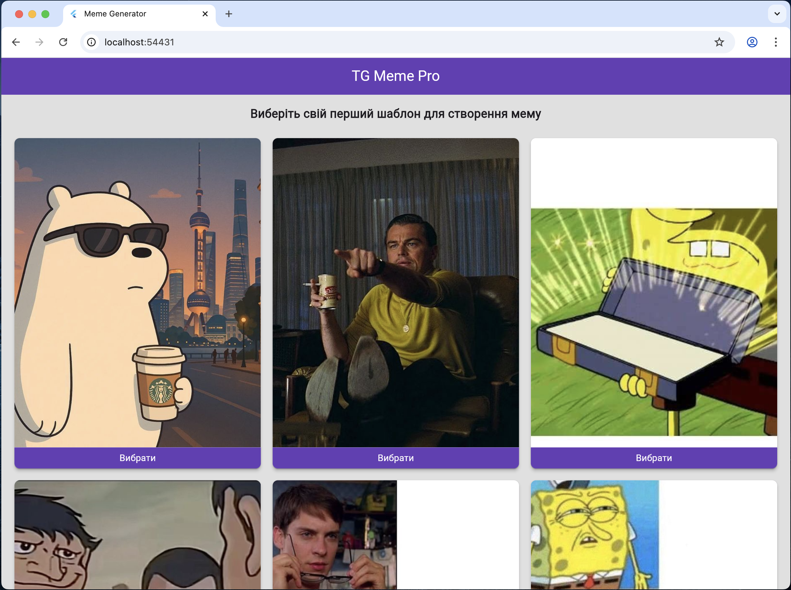
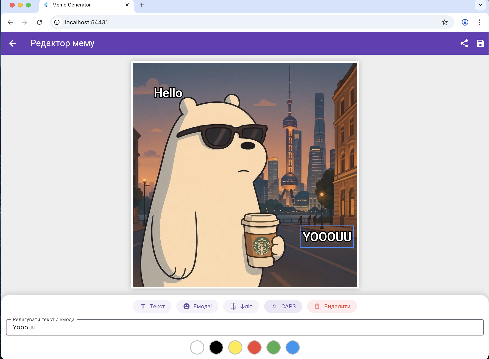

# tg_mini_app.
TG Meme Pro 🚀 High-performance Telegram Mini App for instant meme generation.  Built with Flutter (Web) &amp; Node.js (Canvas API). ✅ Clean Architecture: Service-oriented &amp; scalable. ⚡ Live Preview: Real-time generation with Debounce. 🖼 Template System: Fast &amp; consistent rendering. 📱 TMA Ready: Optimized for Telegram.

✨ Key Features
🎨 Interactive Canvas (Drag & Drop): Users can freely move, scale, and rotate text and emojis using multi-touch gestures (GestureDetector with onScaleUpdate).

🛡️ Smart Boundaries: Implemented mathematical constraints (clamp) combined with LayoutBuilder to ensure draggable elements never escape the visible canvas area, providing a flawless UX on any screen size.

📝 Advanced Typography: Authentic meme styling with custom rendering (simulated text stroke using Stack and Paint) and independent state management for each text node (Color, CAPS lock, Rotation).

🎛️ Context-Aware Toolbar: A dynamic UI (MemeToolbar) that adapts to user actions. Editing tools (Color Palette, Delete, CAPS) smoothly appear only when a specific text element is selected.

🔄 Background Manipulation: Instant horizontal image flipping using matrix transformations (Matrix4.rotationY).

🏗️ Architecture & Clean Code
This project strictly follows Clean Architecture principles and Widget Composition to ensure high maintainability and scalability:

Separation of Concerns: The complex UI is broken down into independent, highly cohesive widgets (MemeCanvas for rendering/gestures and MemeToolbar for user inputs).

State Isolation: Local state (like text coordinates) is encapsulated within specific widget nodes, preventing unnecessary rebuilds of the entire screen and ensuring smooth 60 FPS animations.

Data Models: Utilizing dedicated data classes (MemeTextItem) to manage the state of multiple independent objects on the canvas.

📱 Responsive Design
The application utilizes AspectRatio and adaptive constraints to perfectly fit any device screen, maintaining a 1:1 canvas ratio while dynamically calculating touch boundaries.

🚀 Upcoming Features (Roadmap)
Client-Side Rendering: Implementing RepaintBoundary to capture the composed widget tree and export it as a high-quality Uint8List PNG image.

Telegram Share API: One-tap sharing of the generated meme directly to Telegram chats and stories.

## Screens app on web version

| Home page | Editing_page |
| :---: | :---: |
|  |  |